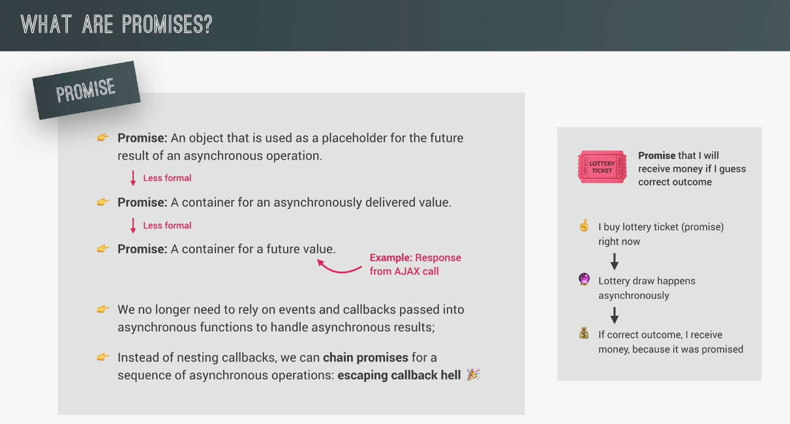
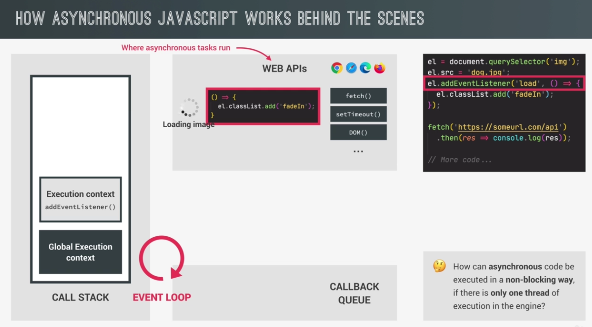

# JS 강의 노트

## 헷갈렸던 것 + 몰랐던 것 위주로 정리!

<br>
<br>

---

# 1. Fundamentals

<br>

### strict mode

- 자바스크립트는 에러가 발생해도 그냥 넘어가는 경우가 있다.
  <br>예를 들어, 선언된 적이 없는 변수에 값을 넣은 경우, strict mode가 아니라면 자동으로 선언해주어 값을 넣는다. 하지만 strict mode라면 not defined 에러가 발생한다.

<br>

### 함수 표현식?

- 익명함수를 만들고 이를 변수에 저장하는 것
  (함수 선언식은 기본적인 방식)

```js
const calcAge = function (birthYear) {
  return 2022 - birthYear;
};
```

<br>

### 함수는 value 이다. (type이 아니다.)

- 그렇기 때문에 변수에 저장할 수 있다.

<br>

### 함수 선언식 vs 함수 표현식

<br>

- 함수 선언식은 선언 전에 사용이 가능하다! (hoisting)
  <br>하지만 함수 표현식은 사용이 불가능하며 두 가지 경우로 나뉜다.
  <br>
  <br>1. 변수를 let, const로 선언하였을 때
  <br>- Cannot access "함수이름" before initialization 에러 발생
  <br>발생이유? => let, const로 선언한 변수는 실질적으로 hoisting이 발생하지 않는다고 볼 수 있기 때문에 선언이 되기 전에 접근했다는 에러가 발생한다.
  <br>
  <br>2. 변수를 var로 선언하였을 때
  <br>"함수이름" is not a function 에러 발생
  <br>발생이유? => var로 변수를 선언하였기 때문에 hoisting에 의해 변수가 선언된 상태로 코드가 실행됨
  <br> 하지만 값이 없이 변수 선언만 된 상태이므로 not defined 에러 대신에 not a function 에러가 발생하는 것
  <br>(이 때 변수의 값은 undefined 이다. 변수 선언 후에 값을 지정하지 않은 상태이기 때문이다.)

<br>

---

<br>

# 2. JS Behind The Scenes

<br>

## 자바스크립트의 9가지 특징 🐻

<br>

### 1. High-level

- high-level 언어이기 때문에 컴퓨터의 resource를 직접 manage할 필요가 없다. (automatic)

<br>

### 2. Garbage-collected

- 오랫동안 사용되지 않은 object들을 자동적으로 컴퓨터의 메모리에서 삭제시킨다.

<br>

### 3. Interpreted or just-in-time compiled

- 나중에 설명

<br>

### 4. Multi-paradigm

- 다음 3가지 paradigm 모두 사용 가능하다.
- Procedural programming (절차지향 프로그래밍)
- Object-oriented programming (객체지향 프로그래밍)
- Functional programming (함수형 프로그래밍)

<br>

### 5. Prototype-based object-oriented

- JS에서 primitive type을 제외하면 모두 object이다. (array, function 등)

- 자세한건 나중에 설명

<br>

### 6. First-class functions

- 일급 함수라고 하며 함수가 변수처럼 다뤄지는 것을 뜻한다. 예를 들면, 함수의 파라미터로 또 다른 함수가 들어갈 수 있는 점이 있다.

<br>

### 7. Dynamic

- Dynamically-typed language이고 이는 변수를 선언할 때 타입을 지정하지 않고 런타임 때 타입이 정해지게 된다.

<br>

### 8. Single-threaded

- JS는 single-threaded 언어이기 때문에 한 번에 하나의 작업만을 수행할 수 있다. (only do one thing at a time)

<br>

### 9. Non-blocking event loop

- single-threaded는 만약 시간이 오래걸리는 작업을 먼저 수행한다면 뒤의 모든 작업들이 실행되지 못하는 blocking 현상이 발생할 수 있다. 하지만 JS는 event loop를 사용하여 blocking 현상이 일어나지 않도록 한다.

<br>
<br>
<br>

## Compilation 🆚 &nbsp;Interpretation

코드를 실행하기 위해서는 먼저 기계어로 변환되어야 한다. 그 방식에는 compilation과 interpretation 두 가지가 있다.

<br>


<br>

### Compilation

- 우선, 소스코드가 machine code로 번역된 file로 변환된다.

- 해당 file을 실행하면 프로그램이 실행된다.
- 장점: interpretation보다 빠르다.

<br>

### Interpretation

- 소스코드를 line-by-line으로 실행한다. (느림)

<br>

### Just-in-time compilation (JIT)

- 현재 자바스크립트가 사용하는 방식 (성능 개선을 위함)

- 먼저 전체 코드가 machine code로 변환된 후에 바로 실행된다.

<br>

### JS 엔진의 작동 방식

1. Parsing

- 전체 코드가 abstract syntax tree (AST)로 파싱된다. (트리 형태)

- 의미 있는 조각으로 나눈다 (const, function 등의 키워드로)
- 파싱된 결과는 machine code를 생성하기 위해 사용된다.

<br>

2. Compilation

- 파싱된 결과로 machine code로 변환시키는 과정

<br>

3. Execution

- compilation의 결과를 실행

<br>

4. optimization

- JS 엔진은 처음에 매우 unoptimized한 버전의 machine code를 만들게 된다. 왜냐하면 일단 최대한 빠르게 실행을 해야하기 때문에 최적화를 시키지 않기 때문이다.

- 그 뒤로 background에서 recompiling을 통해 optimization을 수행한다. (실행을 멈추지 않는다)

<br>

<br>

## JS RUNTIME

<br>

### 1. Event Loop

<br>

- runtime => JS를 사용하기 위해 필요한 모든 것들이 담긴 container라고 할 수 있다.

- JS 엔진, WEB APIs, Callback Queue로 이루어져 있다. (크게 볼 때 3개)

- WEB APIs는 브라우저에서 제공되며 window object (전역 객체)로 접근할 수 있다. 그리고 브라우저에서 제공되는 것들이기 때문에 node.js의 runtime에는 이 부분이 빠지게 된다.

- 실행할 준비가 완료된 모든 콜백함수들이 들어있는 queue이다.

<br>

<br>

## 실행 컨텍스트 (Executiion context)

<br>

JIT 방식의 parsing - compilation - execution 의 3가지 단계 중 마지막 execution 단계에 대한 부분이다.

<br>

### 실행 방식

<br>

1. compilation의 결과로 machine code가 생성되어 execution이 시작된다. 이 때 global execution context (for top-level code)가 생성된다. 여기서 top-level code란 어떤 함수 안에 있지 않은 코드를 말한다. (함수 호출 없이도 실행되어야 하는 코드들)

<br>

2. global Execution context가 생성된다. 이것은 단 하나만 존재한다.

<br>

3. 함수를 실행하고 callback을 기다린다.

<br>

function은 모두 자기 자신만의 execution context를 갖는다. 함수가 호출될 때 생성된다. (호출될 때 call stack에 들어감)

<br>

### Execution context 구성

<br>

실행 직전에 만들어진다.

<br>

1. variable environment

- let, const, var 선언
- functions
- arguments object (not in arrow function)

<br>

2. scope chain

<br>

3. this (not in arrow function)

<br>

## Call Stack

<br>

Call stack은 JS엔진에 있으며 코드가 실행될 때 현재 어떤 execution context를 실행중이고 이게 끝나면 어떤 execution context로 돌아가야 하는지 알 수 있게 해준다.


<br>

예를들어 위의 사진의 코드를 실행한다고 하면 가장 먼저 global execution context가 call stack에 들어가서 실행된다.

<br>

global execution context는 어떤 함수 안에도 속해있지 않은 코드들만 실행되는 것이기 때문에 두개의 함수 선언식, 표현식은 실행되지 않고 가장 마지막의 first 함수 호출이 실행된다.

<br>

이 때, first 함수가 실행되어야 하기 때문에 first 함수만의 execution context가 생성되어 call stack에 들어가게 된다.

<br>

그리고 first 함수를 실행하던 중에 second 함수를 실행하도록 코드가 작성되어있기 때문에 second 함수의 execution context가 생성되어 call stack에 들어간다.

<br>

그 뒤로 second 함수의 return이 실행되고 second 함수의 execution context는 call stack에서 pop된다.

<br>

그 다음은 call stack의 가장 위에 first 함수가 남게 되기 때문에 first 함수의 남은 부분을 실행한다. 여기서 이게 가능한 이유는 call stack 때문이다. second 함수 실행이 종료된 후에 어디로 갈 지 알 수 있었기 때문이다. 마찬가지로 first 함수 또한 return 되어 종료되고 나면 call stack에서 pop되고 그 뒤에 call stack의 가장 위에 남은 global execution context가 남은 부분을 실행하고 call stack에서 pop되어 실행이 종료된다.

## Scope & Scope Chain

<br>

### 용어 설명

<br>

1. scoping

- scope를 생성하는 과정, 방법 정도로 이해

- 변수들이 어디에 있고, 어디서 접근 가능하고 또는 접근이 불가능한지

<br>

2. lexical scoping

- scoping은 함수 또는 코드블럭이 어디에 위치해있는가 (어디에서 작성되었는가)에 따라 결정된다.

<br>

3. scope

- 함수 또는 변수가 선언된 공간/환경

- scope에는 global scope, function scope, block scope가 있다.

<br>

4. scope of variable

- 어떤 변수에 접근(access)할 수 있는 곳

<br>

### scope의 종류

<br>

1. global scope

- 모든 함수와 코드블럭의 외부에 존재하는 변수들의 scope

- global scope의 변수들은 코드의 어떤 곳에서도 접근이 가능하다.

<br>

2. function scope

- 함수 내부에서 선언된 변수, 함수들의 scope

- 함수 내부에서만 접근이 가능하다
- 다른 말로는 local scope라고 한다.

<br>

3. block scope (ES6+)

- 코드블럭 내부에서 선언된 변수, 함수들의 scope (function, if, for)

- let과 const로 선언된 변수들만 적용되며 var은 이것에 적용되지 않는다 (ES6 이전에 나온 것이기 때문에)

- 함수 선언식은 strict mode에서 block scope이다. (strict mode 아니면 function scope)

<br>

### Scope Chain

<br>

모든 스코프는 자신의 바깥에 있는 변수들에 접근이 가능하다. 이것이 스코프 체인이다.

<br>

어떤 변수에 access하려고 할 때, 자기 자신의 scope(current scope)에 찾고있는 변수가 있다면 그것을 사용한다. 하지만 없다면 scope chaining을 통해 변수를 찾게된다.

<br>

우선 자기 자신의 scope에 해당 변수가 없다면 먼저 자신의 바로 위의 스코프로 가서 변수를 찾는다. 여기서 바로 위라는 말은 자기 자신의 가장 가까운 부모의 scope이다.

<br>


위의 사진에서 second 함수에서 myName 변수와 age 변수에 접근해야 한다.

하지만 second 함수 내부에는 해당 변수들이 존재하지 않는다. 그래서 scope chain을 해서 바로 위의 scope인 first 함수의 scope에서 변수들을 찾는다.

여기서 age 변수는 찾았지만 myName 변수는 찾지 못했다. 그래서 그보다 바로 하나 더 위의 scope인 global scope로 이동해서 찾는다.

여기서 decade 변수는 const로 선언되었기 때문에 if 블럭 안에서만 접근 가능하다.

<br>

주의) scope chain은 코드가 쓰여진 위치에 따라 결정되는 것이고 함수가 호출된 위치는 상관없다.

<br>

### 정리

<br>


<br>

<br>

## Hoisting

<br>

변수들이 선언되기 전에 접근 또는 사용이 가능한 경우가 있다. 이것은 hoisting이 일어났기 때문이다.

변수들이 코드의 최상단으로 끌어올려졌다고도 표현한다.

<br>

### 발생하는 이유?

- 코드 실행 전(creation phase)에 먼저 코드를 스캔한다. 이 때 변수 선언이 있다면 execution context의 variable environment의 object의 프로퍼티로 저장되기 때문에 접근, 사용이 가능해지는 것이다.

<br>

### 변수/함수 종류 별 hoisting 여부 정리

<br>


<br>

1. function declaration

- 호이스팅 발생

- 선언 전에 접근+사용 가능
- strict mode에서는 block scope, 아니라면 function scope

<br>

2. var variables

- 호이스팅 발생

- 선언 전에 접근 가능, 값은 undefined
- function scope

<br>

3. let, const variables

- 호이스팅 발생은 하지만 기능적으론 발생하지 않은 것과 같음

- 선언 전에 접근 불가능, 하지만 접근하려 하면 referrence error가 나오지 않고 cannot access before initialization 에러가 발생 (TDZ)
- block scope

<br>

4. function expressions and arrows

- 함수가 담길 변수를 var, let, const 중 어떤 것으로 선언했는지에 따라 hoisting 여부가 결정됨

- 선언 전 접근 여부도 위와 같이 결정됨, var이라면 접근가능, 하지만 함수 사용은 불가능 (undefined) / let, const라면 접근 불가능 (uninitialized)
- scope 또한 var, let, const에 따라 다름

<br>

<br>

## TDZ

<br>

Temporal Dead Zone

변수 선언 전에 해당 변수에 접근하는 것

not defined가 아닌 cannot access before initialization 에러 발생
(creation phase때 코드를 스캔하여 선언될 변수들을 미리 variable environment에 넣었기 떄문에 언젠간 선언될 것이라는 것을 알고있다.)


사진의 붉은 부분이 TDZ이다. 쉽게 말하면 변수가 선언되기 전 까지의 코드 부분이 TDZ라고 할 수 있다. 이 TDZ에서는 변수에 접근할 수 없다.

<br>

<br>

## This

- 모든 execution context (즉, 함수) 마다 생성되는 특별한 변수

- static하지 않은 변수이다. this는 함수가 어떻게 호출되었는지에 따라 어떤 값을 가질 지 결정된다. 그리고 그 값은 <b style="color: skyblue">함수가 실제로 호출되었을 때에만 값이 지정된다.</b>

<br>

### this 값이 지정되는 경우 (함수 호출 방식)

<br>

1. method 호출

- <b style="color: skyblue">자기 자신을 호출한 object가 this값이 된다.</b>

- 만약 method가 arrow function 이라면 자신을 호출한 object가 아닌 lexical this

- method 내부의 this가 자신의 바깥의 object를 가리키는 이유는 그 object의 내부에서 작성되었기 때문이 아니라 그 object가 호출(사용)했기 때문이다. 예를 들어 a,b object가 있고 a의 내부에 calcAge라는 method가 있고 이 method에서 this를 사용했을 때, b.calcAge = a.calcAge로 b에서 a의 method를 borrow했을 때 b.calcAge를 실행시켜보면 this는 b object를 가리키고 있는 것을 확인할 수 있다.
  method가 작성된 곳은 a object이지만 b에서 빌려서 호출하니 this는 b를 가리키고 있는 것이다. 따라서 method의 this는 자신을 <b style="color: skyblue">호출한 obejct</b>를 가리킨다.
- 만약 위와같은 방법으로 일반적인 변수에 method를 copy시켜서 함수를 호출시켰다면? => 일반적인 함수호출이기 때문에 2번과 같은 결과가 나온다.

<br>

2. 일반적인 호출 (simple function call)

- this = undefined (only in strict mode)

- this = window obejct (global object) (not in strict mode)
- method의 내부함수에서의 this는 2번과 같다. method의 경우에는 1번과 같이 동작하지만 method의 내부함수는 다르다.
- 내부함수의 this문제 해결법에는 두가지가 있다.
- 첫 번째로 method 내부에 const self = this로 변수를 만들어 주고 이를 내부함수에서 사용한다. (es6 이전의 방식)
- 두 번째는 내부함수를 arrow function으로 선언하는 것이다. arrow function은 this값이 자신의 상위 스코프를 가리키게 되기 때문에 method와 같은 this를 갖게되고 이는 object의 scope와 같다. (es6+ 방식)

<br>

3. arrow function 호출

- this = 자신의 바로 위의 scope (surrounding function, lexical this)

- method로는 arrow function을 사용하지 않는 것이 좋다. this 키워드가 자신의 바로 위의 scope로 지정되기 때문에 혼동(원하지 않는 결과)이 오기 쉽다. object literal의 코드블럭은 자신만의 scope를 갖게되는 것이 아니므로 object의 method로 arrow function을 사용했다면 this로 object의 내부의 값을 참조할 수 없다.

<br>

4. event listener로 호출

- this = DOM element that the handler function attatched to

<br>

5. new 연산자로 호출

- later section

<br>

<br>

## Arguments

- 파라미터로 넘긴 값들이 들어있는 객체

- 함수 선언식, 함수 표현식에만 사용 가능하며 arrow function에서는 사용할 수 없다.

<br>

<br>

## Primitives vs Objects

<br>


위의 코드에서 oldAge의 값은 age의 값이 변경되기 전의 값이 그대로 유지되었지만 me object의 age는 friend.age에 의해 함께 변한 것을 볼 수 있다. 그 이유는 무엇일까

<br>

### Primitive와 Object의 차이

- primitive는 call stack에 저장되며 object는 memory heap에 저장된다. (이 둘은 JS Engine에 있음) <br>
  primitive가 call stack에 저장된다는 말은 자신들이 선언된 execution context의 내부에 저장된다는 뜻이다. (call stack에 들어가는 execution context의 내부에 들어간다는 뜻)

<br>


(위의 사진 설명)

<br>

primitive value는 call stack의 자신이 선언된 execution context에 저장되며 address와 value를 갖는다. <br>
먼저 age라는 변수를 선언하고 값을 30으로 넣어주었기 때문에 0001주소에 30이라는 값이 들어가게 되고 age 변수는 이를 가리키게 된다. <br>
그리고 oldAge는 oldAge = age에 의해 age가 가리키고 있는 0001주소를 가리키게 되고 그렇기 때문에 똑같이 30이라는 값을 갖게된다.<br>
하지만 age = 31에 의하여 age변수의 값은 31로 변경되었다.
<br>
여기서 주목할 점은, call stack의 memory adress의 값은 immutable(불변)하다는 것이다.
<br>
그렇기 때문에 0001 주소의 value가 31로 변경되는 것이 아니라 0002라는 새로운 주소에 31이라는 값을 넣고 age변수가 이를 가리키게 되는 것이다. <br>
그렇기 때문에 age는 31, oldAge는 30의 값을 갖게되는 것이다.

<br>
<br>
하지만 reference value (object)는 사진과 같이 값을 저장한다.<br>
call stack의 메모리 공간의 0003이라는 주소에 D30F라는 value를 갖게된다.<br>
object의 value는 call stack에 담기기에 너무 클 수 있기 때문에 비교적 unlimited한 heap에 저장하는 것이다. <br>
여기서 주목할 점은 value가 일반적인 value가 아닌 memory heap의 주소라는 것이다. 이 value는 memory heap의 주소를 갖고 있기 때문에 이를 이용해서 heap에 저장되어있는 value를 갖고온다.
<br>
me와 friend는 동일한 주소를 가지고 있고, 그렇기 때문에 friend.age를 변경하였을 때 heap의 value가 변경되어 me.age까지 27로 변경된 것이다.
<br>
여기서 friend object는 const로 선언되었음에도 불구하고 변경이 가능했는데 그 이유는 call stack의 value는 변경되지 않았기 때문이다.
<br>
me와 friend object는 서로다른 identifier가 완전히 동일한 reference를 가리키고 있는 것이다.

따라서 object를 copy하는 것은 진짜 copy하는 것이 아닌 그저 같은 reference를 가리키고 있는 또 다른 변수를 생성한 것 뿐이다.

<br>
<br>

---

# 3. A Closure Look at Functions

<br>

## Default Prameters


<br>

- 주석 처리된 부분은 pre ES6 방식이고 파라미터로 넘겨주는 것이 ES6+ 방식이다. (price = 199 이 부분)

- 파라미터 안넘겨주면, 또는 undefined로 넘겨주면 default parameter로 들어간다.
- price = 199 * numPassengers 이런식으로 넣어주면 자동으로 인원수*1인가격 계산해줌

<br>

## Passing Arguments

<br>


<br>

parameter로 넘겨줄 때, arguments는 parameter의 copy라고 보면 된다.

<b>passing by value vs reference</b>

- flight (primitive) 변수와 jonas object를 함께 파라미터로 넘겨준 뒤에 함수 내부에서 두 arguments를 변화시킴, 하지만 flight 변수는 변경되지 않았고 jonas object는 변경됨

- flightNum argument는 flight 변수를 copy한 primitive 변수이기 때문에 앞서 배운 내용에 따라 원본은 변경되지 않는 것을 알 수 있음

- 하지만 jonas object는 reference variable이기 때문에 주소 자체를 넘겨준 것임, 따라서 passenger argument를 변경시키면 jonas object가 가리키고 있는 주소의 value를 변경시킨 것이기 때문에 jonas object도 변경되어 나오는 것

<br>

## First-Class Functions

<br>

- programming language의 feature라고 할 수 있다. (모든 함수는 value이다)

- JS는 function을 first-class citizen으로 다룬다. 이것은 function이 단순한 value라는 것을 의미한다. 그 이유는 function은 object의 또 다른 type이기 때문이다. (object는 value이니까)

- 이것은 function으로 부터 function을 return할 수 있음을 의미한다. (function = value 이니까) 이는 매우 유용하게 사용 가능하다.

- Function은 object이기 때문에 method를 가지고 있다.

- First-class function은 higher-order function을 사용/작성 가능하게 해준다.

<br>

## Higher-Order Functions

<br>

- First-class function이 있기 때문에 가능한 것 (first-class function의 가장 위의 설명과 이것이 둘의 차이점)

- Higher-order function은 함수를 arguments로 받거나 함수를 return하는 함수이다. (또는 둘 다 하는 함수)

- 예를 들어, addEventListener 함수는 2번 째 파라미터로 콜백 함수를 받는다. (변수로써)

<br>

### Functions Accepting Callback Functions

<br>

 

transformer 함수에서 callback함수를 fn으로 받고 사용한 모습이다. 여기서 파라미터를 넘겨줄 때 upperFirstWord, onWord 이런 식으로 변수의 형태로 넘겨준 것이 포인트이다.

함수를 파라미터로 넘겨주는 것은 abstract한 장점이 있다. transformer 함수는 string을 변환시켜주는 역할을 한다. 하지만 실제로 어떻게 변환하는 지는 전혀 신경쓰지 않는다 (알지 못한다). 그저 넘겨준 콜백함수를 실행시키는 것 뿐이다.

higher-order function = operates higher level of abstraction, leaving the low level details to low level functions (call back) (low level function이라는 말은 없고 그냥 설명을 위한 단어 사용)

<br>

### Functions Returning Functions

<br>


<br>

greeterHey는 함수가된다. (return된 함수를 받은 것)

그리고 greeting은 Hey로 고정된 상태이다.

greet("Hello")("Steven") 이런 식으로도 사용 가능하다. 왜냐하면 greet("Hello") 자체가 함수이기 때문이다.

greet 함수를 arrow function으로 다시 작성해보면 위의 greetArr와 같이 된다. arrow를 두개 사용한다.

<br>

## Call, Apply, Bind Methods

<br>

### 사용 예제

<br>

```js
const lufthansa = {
  airline: "Lufthansa",
  iataCode: "LH",
  bookings: [],
  // book: function() {}
  book(flightNum, name) {
    console.log(
      `${name} booked a seat on ${this.airline} flight ${this.iataCode}${flightNum}`
    );
    this.bookings.push({ flight: `${this.iataCode}${flightNum}`, name });
  },
};

lufthansa.book(239, "Jonas Schmedtmann"); //method이므로 this = lufthansa
lufthansa.book(635, "John Smith"); //method이므로 this = lufthansa

const eurowings = {
  airline: "Eurowings",
  iataCode: "EW",
  bookings: [],
};

const book = lufthansa.book; //first-class function 가능하기 때문에 book 변수에 method 함수 담기

// Does NOT work
book(23, "Sarah Williams"); // 일반적인 함수 호출, this = undefined(strict mode)이므로 에러 발생

// Call method
book.call(eurowings, 23, "Sarah Williams"); // 첫 번째 파라미터로 this binding할 객체 넣어주고 그 뒤로는 함수에 넣을 파라미터 넣어줌
console.log(eurowings);

book.call(lufthansa, 239, "Mary Cooper"); // 메소드를 원래 갖고있던 lufthansa 객체에도 가능
console.log(lufthansa);

const swiss = {
  airline: "Swiss Air Lines",
  iataCode: "LX",
  bookings: [],
};

book.call(swiss, 583, "Mary Cooper"); // 또 다른 object로 테스트

// Apply method
const flightData = [583, "George Cooper"];
book.apply(swiss, flightData); // apply는 call과 다르게 파라미터들을 배열 형태로 넘겨준다.
console.log(swiss);

// Bind Method
const bookEW = book.bind(eurowings);
const bookLH = book.bind(lufthansa);
const bookLX = book.bind(swiss); //bind 안에는 this binding할 object 넣음

bookEW(23, "Steven Williams"); //새로 선언한 변수로 함수 호출

const bookEW23 = book.bind(eurowings, 23); //함수에 넣을 파라미터까지 넣을 수 있음
bookEW23("Jonas Schmedtmann"); //미리 넣어뒀던 23을 안넣고 바로 이름만 넣어도 정상 작동
bookEW23("Martha Cooper");

const full = book.bind(swiss, 21, "JONG");
full(); // 21, JONG 넣은 상태로 실행
```

> this가 어디에 바인딩 될 것인지 지목해줄 수 있다. (allows us to manually set 'this' keyword) <br>
> 위의 코드에서 보이다시피 bind method는 새로운 함수를 return한다. 그래서 이 return된 함수를 변수에 저장해서 사용 가능한 것이다.

<br>

### Event Listener에서의 사용

<br>

```js
// With Event Listeners
lufthansa.planes = 300;
lufthansa.buyPlane = function () {
  console.log(this);

  this.planes++;
  console.log(this.planes);
};

lufthansa.buyPlane(); // method 호출 => this = lufthansa

// Case 1 : this = DOM Element $(".buy")
document
  .querySelector(".buy") //
  .addEventListener("click", lufthansa.buyPlane);

// Case 2 : this = lufthansa
document
  .querySelector(".buy")
  .addEventListener("click", lufthansa.buyPlane.bind(lufthansa));
```

> addEventListener에서 this는 이벤트가 발생한 DOM 엘리먼트가 된다. 따라서 lufthansa.buyPlane에서 의도한대로 동작하기 위해서는 bind method가 필요하다.

<br>

### Partial Application

```js
// Partial application
const addTax = (rate, value) => value + value * rate;
console.log(addTax(0.1, 200));

const addVAT = addTax.bind(null, 0.23);
// addTax 함수에서 rate 값을 고정시키고 싶다.
// 그리고 이 함수에서 this값은 쓰이지 않기 때문에 this binding이 필요하지 않다.
// 그렇기 때문에 addTax.bind(null,0.23)이 된다 (this binding 부분에 null 넣음)

console.log(addVAT(100));
console.log(addVAT(23));

// addVAT 함수처럼 사용 가능한 함수 (rate 먼저 지정하고 return된 함수에서 고정된 rate값으로 사용)
// higher-order function
const addTaxRate = function (rate) {
  return function (value) {
    return value + value * rate;
  };
};

const addVAT2 = addTaxRate(0.23);
console.log(addVAT2(100));
console.log(addVAT2(23));
```

<br>

## IIFE (즉시 실행 함수)

- 단 한번만 실행되는 함수

```js
// IIFE
(function () {
  console.log("HIHI");
})();

// IIFE ARROW
(() => console.log("ARROW TOO"))();

//WHY? => scope
//scope가 생성되었기 때문에 이 안에서 선언된 변수는 외부에서 접근 불가능 => private한 변수 생성 (encapsulate, data privacy)
(function () {
  const isPrivate = 23;
})();

console.log(isPrivate); //ERROR

//하지만 modern JS에서는 사용하지 않는다
//과거에는 var을 사용했기 때문에 function scope여야 encapsulate할 수 있었기 때문에 이와같이 사용을 했다.
//하지만 block scope인 let, const가 나왔기 때문에 즉시실행 함수가 아닌 단순한 코드블럭만으로도 encapsulate을 할 수 있다.

{
  const isPrivate = 23;
  let isPrivateToo = 12;
}

console.log(isPrivate); //ERROR
console.log(isPrivateToo); //ERROR
```

<br>

## Closure

```js
const secureBooking = function () {
  let passengerCount = 0;

  return function () {
    passengerCount++;
    console.log(`${passengerCount} passengers`);
  };
};

const booker = secureBooking();

booker(); //1 passengers
booker(); //2 passengers
booker(); //3 passengers
```

위의 코드에서 const booker = secureBooking();이 실행되면 call stack에 secureBooking 함수의 execution context가 들어가게 되고 return된 함수가 booker 변수에 저장되며 이 execution context는 call stack에서 pop된다.

그러나 booker 함수를 3번 실행해본 결과 이는 passengerCount변수를 계속해서 기억하며 1씩 증가시키고 있다.

이미 secureBooking 함수는 call stack에서 빠져나갔지만 booker 함수는 secureBooking의 내부 환경을 기억하고 있는 것이다. 이것이 closure이다.

모든 function은 항상 자신이 만들어진 execution context의 variable environment에 접근할 수 있다.

variable을 찾을 때 scope chain보다도 closure을 먼저 탐색한다. (priority가 scope chain보다 높다.)

<br>

```js
let f;

const g = function () {
  const a = 23;
  f = function () {
    console.log(a * 2);
  };
};

const h = function () {
  const b = 777;
  f = function () {
    console.log(b * 2);
  };
};

g();
f(); //46

// Re-assigning f function
h();
f(); //1554
console.dir(f);
```

위의 코드에서 a라는 변수는 g function에서 선언된 변수이다. 그리고 f()의 시점에선 이미 g의 함수 실행이 종료되고 execution context가 call stack의 밖으로 나간 상태이다. 하지만 f()의 결과로 a변수에 2를 곱한 값인 46이 정상적으로 출력된다.

그리고 같은 방법으로 h function에서 f를 reassign해주고 f를 다시 실행해보면 이번엔 closure로 b변수를 access하고있다.

<br>


f변수를 console.dir로 출력해보고 [[Scopes]] (괄호의 의미는 코드에서 접근할 수 없는 영역이라는 의미)의 0번을 보면 Closure (h) {b: 777} 부분을 볼 수 있다.

<br>

이는 h라는 함수의 closure로 b라는 변수를 접근할 수 있다는 것을 알 수 있고 0번에 있기 때문에 scope chain보다 priority가 높다는 것도 알 수 있다.

<br>

```js
const boardPassengers = function (n, wait) {
  const perGroup = n / 3;

  setTimeout(function () {
    console.log(`We are now boarding all ${n} passengers`);
    console.log(`There are 3 groups, each with ${perGroup} passengers`);
  }, wait * 1000);

  console.log(`Will start boarding in ${wait} seconds`);
};

boardPassengers(180, 3);
```

setTimeout의 예제) setTimeout의 콜백함수는 boardPassengers와 별개로 동작한다.

setTimeout의 콜백함수는 call back queue (taskqueue)에 들어가서 시간이 되면, 그리고 call stack이 비어있으면 call stack으로 불러와서 실행하기 때문에 반드시 boardPassengers 함수 실행이 종료된 후에 실행이 되게 된다.

그런데 이 콜백함수에서 boardPassengers 함수의 argument (즉 함수의 로컬변수와 같은)인 n 변수와 boardPassengers에서 선언된 perGroup변수를 사용하고 있다. 이것도 클로저이다.

<br>

#### Coding Challenge (Closure)

```js
(function () {
  const header = document.querySelector("h1");
  document.addEventListener("click", function () {
    header.style.color = "blue";
  });
})();
```

Explain to myself

> header변수는 즉시실행함수의 execution context의 variable environment에서 생성되었다.<br>그리고 addEventListener의 콜백함수는 click이벤트가 document에서 발생했을 때 callback queue로 들어가서 call stack이 비어있을 때 call stack으로 이동되어 함수가 실행되게 된다.<br><br>
> 이는 이미 IIFE의 실행이 끝난 이후이지만 콜백함수는 자기 자신이 만들어진 execution context의 variable environment, 즉 여기서는 IIFE의 variable environment에 항상 access할 수 있기 때문에 이것이 가능하다.(closure)

<br>

---

## Asynchronous JS

<br>

### Synchronous vs Asynchronous

<br>

#### 1. Synchronous

- 대부분의 코드는 synchronous이다.
- synchronous 코드는 line-by-line으로 실행된다.
- 각각의 코드 라인은 이전 라인이 끝나기를 기다렸다가 실행된다. (block)
- Long-running operation은 코드 실행을 오랫동안 block한다. (alert가 좋은 예이다. alert의 확인버튼을 누르기 전 까지는 이후의 코드가 실행되지 않게 block되는 것을 볼 수 있다.)

<br>

#### 2. Asynchronous

- Async 코드는 background실행이 끝난 후에 실행된다. (대기?)
- non-blocking이다. (앞의 코드실행이 끝나기를 기다리지 않는다.)
- not occuring at the same time
- call back function 자체가 자동적으로 async코드가 되는 것은 아니다.
- timer 또는 loading의 경우에 사용된다.

<br>

```js
const img = document.querySelector(".dog");
img.src = "dog.jpg";
img.addEventListener("load", function () {
  img.classList.add("fadeIn");
});

p.style.width = "300px";
```

두번째 줄은 async하게 실행된다. 왜냐하면 이미지를 로드해야 하고 이 때문에 뒤의 코드에 block이 발생하면 성능에 문제가 생기기 때문이다.

그리고 addEventListener자체는 코드를 async하게 만들지 않는다. 이는 background에서 이벤트 발생을 '기다리고' 있는 것이지 무언가를 '하고' 있지 않기 때문이다. (async라는 것이 background에서 task가 실행되어 이것이 끝나면 실제로 실행이 되는 것이므로)

<br>

### AJAX

- web server와의 통신을 async방식으로 하는것을 가능하게 해준다.(dynamic)

- 과거 = XMLHttpRequest, 현재 = fetch

<br>

### Promise

- 미래의 값이 담겨있는 container

- 이를 복권에 비유하면, 복권의 번호를 정하고 구매하는 것은 promise를 생성하는 것과 같고 복권의 당첨 발표는 async하게 background에서 promise의 결과를 받아오기 까지의 과정과 같고 발표 이후에는 만약 번호가 적중했다면 돈을 얻게되는 (미래의 값)것과 같다.



<br>

#### Promise Lifecycle

1. pending

- 미래의 값이 아직 사용 불가능한 상황이다.

<br>

2. settled

- async task가 끝난 상태이다. 이 상태에서는 두 가지로 나뉜다.
- FULFILLED : 성공적으로 값을 받아와서 사용 가능한 상태이다.
- REJECTED : 에러가 발생한 상태이다.


<br>

#### Then

- promise의 method이다.

- fulfilled 상태인 promise를 다루기 위해서 사용된다.

```js
const getCountryData = function (contry) {
  fetch(`https://restcountries/rest/v2/name/${country}`) //
  .then((response) => response.json()); // 여기서 response는 위의 fetch로부터 생성되어 fulfilled상태가 된 promise이다.
  .then(result => console.log(result)); // 위의 then에서 return된 response.json()의 결과인 promise가 result가 된다.
};
```

<br>

#### Promise chain

```js
const getPosition = function () {
  return new Promise(function (resolve, reject) {
    navigator.geolocation.getCurrentPosition(resolve, reject);
  });
};

const whereAmI = function () {
  getPosition() //
    .then((pos) => {
      const { latitude: lat, longitude: lng } = pos.coords;

      return fetch(`https://geocode.xyz/${lat},${lng}?geoit=json`);
    })
    .then((res) => {
      console.log(res);
      if (!res.ok) throw new Error(`Problem with geocoding ${res.status}`);
      return res.json();
    })
    .then((data) => {
      console.log(data);
      console.log(`You are in ${data.city}, ${data.country}`);
      return fetch(`https://restcountries.com/rest/v2/name/${data.country}`);
    })
    .then((res) => {
      if (!res.ok) throw new Error(`Country not found ${res.status}`);
      console.log(res);
    })
    .catch((err) => console.error(err));
};
```

기존의 callback 지옥을 벗어날 수 있는 방법이다.
이것은 promise에서 새로운 promise를 생성해서 사용해야할 때 사용할 수 있다.

위의 코드에서는 우선 가장 먼저 getPosition함수를 실행하여 이것에서 promise가 return되면 그 밑의 then이 실행된다.

그 다음에는 해당 promise의 fulfilled value인 lat,lng값을 사용해서 fetch라는 새로운 promise를 실행한다.

그리고는 이것이 fulfilled 상태가 된다면 이것을 return하여 또 다시 밑의 then의 콜백함수를 실행한다.

이런식으로 promise안에서 새로운 promise를 build하여 이 promise의 fulfilled value를 then에서 받아서 사용이 가능하기 때문에 callback지옥보다 훨씬 좋은 코드를 작성할 수 있다.

<br>

#### Building A Simple Promise

- Promise constructor은 단 하나만의 argument를 갖는다. 이 argument는 executor function이다.

- executor function은 async한 동작이 포함되어있는 함수가 들어간다. (async한 동작을 위해서 promise를 사용하는 것이므로)

- executor function은 두가지 argument를 갖는다. resolve와 reject method이다. resolve는 promise의 settled상태 중 fulfilled(= success)상태로 만들어주고, reject는 rejected상태로 만들어준다

- resolve method의 argument는 promise의 fulfilled value이다. (then method에 의해 consume될 수 있도록)

```js
new Promise(function (resolve, reject) {
  if (Math.random() >= 0.5) {
    resolve("당첨"); //then
  } else {
    reject("낙첨"); //catch
  }
})
  .then((res) => console.log(res))
  .catch((err) => console.error(err));
```

만약 Math.random()의 결과가 0.5 이상이라면 resolve 메소드가 실행되어 '당첨'이라는 fulfilled value가 return되어 then으로 넘어간다. <br>반대로 0.5 미만이라면 reject 메소드가 실행되어 '낙첨'이라는 rejected value가 catch로 넘어간다.

<br>

```js
const wait = function (seconds) {
  return new Promise(function (resolve) {
    setTimeout(resolve, seconds * 1000);
  });
};

wait(2)
  .then(() => {
    console.log("2초 기다림");
    wait(1);
  })
  .then(() => console.log("1초 기다림"));
```

프로미스를 return하는 함수를 만들어서 아래와 같이 사용가능하다.

<br>

<br>

### Asynchronous Behind The Scenes (Event Loop)

<br>


위의 코드가 동작하는 과정을 Event Loop에서 확인해보며 async한 동작이 어떻게 이루어질 수 있는지 알아본다

<br>

1. 첫 번째 줄의 코드가 실행된다. (synchronous)

2. 두 번째 줄의 코드가 실행된다. 이미지를 로드하는 것은 오래걸리기 때문에 synchronous하게 동작한다면 call stack에서 뒤의 코드의 실행을 막게 되기 때문에 block이 일어나게 된다.<br>
   그렇기 때문에 이미지를 로드하는 것은 DOM요소와 관련된 async한 동작이다. 따라서 이는 JS Runtime의 WEB APIs에서 동작한다.

3. 세 번째 줄의 addEventListener 부분이 실행된다. 이벤트 리스너의 콜백 함수는 이미지가 로딩되는 곳 (WEB APIs environment)에 등록된다. 이는 load 이벤트가 발생할 때 까지 이곳에 머문다.



<br>

<br>

4. fetch부분이 실행된다. 여기서 then 부분은 fetch로부터 return될 promise(future value)를 받아서 실행되어야 할 부분이기 때문에 이것도 addEventListener부분과 같이 WEB APIs environment에 then부분의 콜백함수가 등록된다.


<br>

<br>

5. 등록해두었던 eventListner의 load이벤트가 발생했다면 이에 대한 콜백 함수가 callback queue로 이동한다.<br>(callback queue는 실행될 준비가 완료된 모든 콜백함수들이 순서대로 들어있는 queue이다.)

<br>

6. event loop에서는 call stack이 비어있는지를 확인하고, 비어있다면 callback queue의 가장 앞의 callback 함수를 call stack으로 옮긴다.<br>여기서는 addEvnetListener의 콜백함수가 call stack으로 이동하게 된다. 이 과정을 event loop tick이라고 한다.<br> 여기서 알 수 있는 사실은 JS engine (call stack + heap) 자체는 시간에 관련해서는 알지 못한다는 것이다. 그저 call stack으로 이동된 함수를 실행하는 것이다. async한 모든 것을 관리하는 것은 runtime이다.

<br>

7. fetch가 완료되어 fulfilled 상태가 되었다면 then의 콜백함수가 microtasks queue로 이동된다. (promise이기 때문에)<br>microtasks queue는 callback queue보다 우선순위가 높다. 그렇기 때문에 만약 microtasks queue의 콜백함수의 실행 결과로 또 다시 microtasks queue에 콜백함수가 생겼다면 callback queue에 콜백함수들이 존재하여도 그 콜백함수를 먼저 call stack으로 이동시킨다. 그렇기 때문에 microtasks queue는 callback queue에 starvation을 일으킬 수 있다.<br> 그리고 call stack이 비어있다면, callback queue와는 다르게 microtasks queue의 모든 콜백함수를 call stack으로 이동시킨다.

<br>

```js
console.log("test start"); // 1

setTimeout(() => console.log("0 sec timer"), 0); //4

Promise.resolve("Resolved Promise 1").then((res) => console.log(res)); // 3

console.log("test end"); // 2
```

위의 코드의 실행 순서는 다음과 같다.

1. 첫 번째 줄의 console.log가 실행된다.

2. 두 번째 줄의 코드가 실행되어 WEB APIs environment에 setTimeout의 콜백함수가 등록되고, 0밀리초 뒤에 callback queue로 이동된다.

3. 세 번째줄의 promise가 바로 resolve되었고 이에 따라 then의 콜백함수가 microtasks queue로 이동된다.

4. 네 번째 줄의 console.log가 실행된다.

5. call stack이 비었으므로 event loop가 microtasks queue를 먼저 확인한다. microtasks queue에 콜백함수가 있으므로 이곳에 있는 모든 콜백함수를 call stack으로 이동시킨다.

6. call stack으로 이동된 콜백함수를 실행한다.

7. 실행이 완료되면 다시 call stack이 비게되고 event loop는 다시 microtasks queue를 확인한다. 하지만 비어있기 때문에 callback queue를 확인한다.

8. callback queue에 콜백함수가 있기 때문에 이 중 가장 앞의 콜백함수를 call stack으로 이동시킨다.

9. 이동된 콜백함수를 call stack에서 실행한다. (이것의 실행이 끝나면 코드 실행 종료)

<br>

```js
console.log("test start");

setTimeout(() => console.log("0 sec timer"), 0);

Promise.resolve("Resolved Promise 1").then((res) => console.log(res));

Promise.resolve("Resolved Promise 2").then((res) => {
  for (let i = 0; i < 5000000000; i++) {}
  console.log(res);
});

console.log("test end");
```

위에서 설명한 코드에서 promise 2 부분을 새로 추가한 코드이다.
여기서 for loop는 50억번을 loop하기 때문에 꽤 오랜 시간이 걸린다. 그래서 이 동안 call stack에서는 block이 발생한다.<br>그 결과로 'Resolved Promise 2' 와 '0 sec timer' 부분이 늦게 출력되는 것을 볼 수 있다.<br>이것을 한 이유는 setTimeout의 delay time은 보장되지 않는다는 것을 알기 위함이다.<br> delay time은 0ms였지만 실제로는 약 5초정도의 시간 뒤에 setTimeout의 콜백함수가 실행되었다. 이것은 callback queue에서 자신보다 앞에 있는 callback함수가 모두 실행되는 것, 그리고 microtasks queue의 모든 callback함수가 실행되는 것을 기다려야 하기 때문이다.<br> <br>그렇기 때문에 만약 delay time이 3000인 경우에, setTimeout의 콜백함수는 코드가 실행되고 나서 3초보다 빨리 실행되는 일이 일어나지 않는다는 것은 보장되지만 정확히 3초뒤에 실행된다는 보장은 없다는 것이다.

<br>

### Async/Await

- ES8 (2017)에 새롭게 추가된 기능이다.

- promise를 기존의 then방식과 다르게 사용할 수 있는 문법적 설탕 역할을 한다.

- promise의 fulfilled value가 사용가능해질 때 까지 기다린 후에 다음 코드를 실행하고 싶다면 해당 함수를 async로 선언하고 기다리고 싶은 코드에 await를 붙여준다.

```js
const getPosition = function () {
  return new Promise(function (resolve, reject) {
    navigator.geolocation.getCurrentPosition(resolve, reject);
  });
};

const whereAmI = async function () {
  const pos = await getPosition();
  const { latitude: lat, longitude: lng } = pos.coords;

  const resGeo = await fetch(`https://geocode.xyz/${lat},${lng}?geoit=json`);
  const dataGeo = await resGeo.json();

  const res = await fetch(
    `https://restcountries.com/v2/name/${dataGeo.country}`
  );

  const data = await res.json();
  renderCountry(data[0]);
};
```

whereAmI 함수는 async하게 동작하는 부분이 들어가기 때문에 async를 함수 선언 앞에 붙여준다.

pos변수에는 getPosition함수에서 return한 promise의 fulfilled value 값을 할당하고 싶다. 그렇기 때문에 해당 함수 실행 부분의 앞에 await를 붙였다.

그 뒤로도 fetch나 fetch된 결과를 json메소드로 json화 시키는 과정에서도 async한 동작이 필요하기 때문에 await를 붙여서 이를 원하는대로 비동기 동작이 가능하도록 하였다.

<br>

### Try, Catch, Finally

- try는 실행하고 싶은 코드가 작성되는 부분이다.

- catch는 만약 try로부터 에러가 발생했다면 해당 에러를 컨트롤할 수 있는 부분이다. 해당 에러는 catch에 파라미터로 넘겨지게 된다.

- finally는 에러발생 여부와는 상관 없이 반드시 마지막에 실행되는 코드가 작성되는 부분이다.

<br>

### Returning Values From Async Functions

async function을 사용해서 then, catch를 사용한 경우, catch가 아닌 then부분이 실행된다.

```js
// 윗 부분 생략
const whereAmI = async function () {
  try {
    const pos = await getPosition();
    const { latitude: lat, longitude: lng } = pos.coords;

    const resGeo = await fetch(`https://geocode.xyz/${lat},${lng}?geoit=json`);

    if (!resGeo.ok) throw new Error("ㅋㅋ");
    const dataGeo = await resGeo.json();

    const res = await fetch(
      `https://restcountries.com/v2/name/${dataGeo.countryddd}` // 일부러 에러 발생
    );

    if (!res.ok) throw new Error("ㅎㅎ");

    const data = await res.json();

    if (data.status === 404) throw new Error("problem getting country");

    renderCountry(data[0]);
  } catch (err) {
    alert(err.message); // 정상적으로 실행됨
  }
};

whereAmI()
  .then((city) => console.log(city)) // 실행됨
  .catch((err) => console.error(err)); // 실행 안됨
```

코드 가장 아래 부분에서 whereAmI 함수는 에러를 발생했음에도 불구하고 fulfilled가 되어 then부분이 실행되고 catch부분은 실행되지 않았다.

이것을 해결하기 위해서 async함수의 catch부분에도 throw error하는 부분이 있어야 한다.

<br>

```js
// pre ES8
whereAmI()
  .then((city) => console.log(city))
  .catch((err) => console.error(err))
  .finally(() => console.log("finished!!"));

// ES8+
(async function () {
  try {
    const city = await whereAmI();
    if (!city) throw new Error("Error");
    console.log(city);
  } catch (err) {
    console.error(err);
  }
  console.log("finished!");
})();
```

상단의 과거형 문법인 then catch 대신에 최신 문법인 async/await를 사용하여 변형한 모습이다.

async한 함수를 사용하는데 이것 또한 async하게 작동되어야 한다면 IIFE로 필요한 부분을 하나의 함수로 묶고 IIFE를 async로 선언하여 사용할 수 있다.

<br>

### Promise in Parallel

<br>

Promise.all method를 사용한다.

```js
const getJSON = function (url, errorMsg = "something went wrong") {
  return fetch(url).then((response) => {
    if (!response.ok) throw new Error(`${errorMsg} (${response.status})`);
    return response.json();
  });
};

// 수정 전
const get3Countries = async function (c1, c2, c3) {
  try {
    const [data1] = await getJSON(`https://restcountries.com/v2/name/${c1}`);
    const [data2] = await getJSON(`https://restcountries.com/v2/name/${c2}`);
    const [data3] = await getJSON(`https://restcountries.com/v2/name/${c3}`);

    console.log([data1.capital, data2.capital, data3.capital]);
  } catch (err) {
    console.error(err);
  }
};

// 정상작동하지만 parallel하게 동작하지 않음. data2는 data1을 기다렸다가 fetch하고 data3은 data2와 data1을 기다린다.
// 여기서 많은 시간이 지체될 수 있다. 이들을 평행하게 실행시킨다면 훨씬 빠른 실행이 가능하다.
get3Countries("portugal", "canada", "tanzania");

//
//

// 수정 후 (promise.all() 사용)
const get3Countries = async function (c1, c2, c3) {
  try {
    const data = await Promise.all([
      getJSON(`https://restcountries.com/v2/name/${c1}`),
      getJSON(`https://restcountries.com/v2/name/${c2}`),
      getJSON(`https://restcountries.com/v2/name/${c3}`),
    ]);
    console.log(data.map((d) => d[0].capital));
  } catch (err) {
    console.error(err);
  }
};

// network 탭을 열어서 cascade를 확인해보면 fetch 요청을 거의 동시에 보내는 것을 확인할 수 있다.
get3Countries("portugal", "canada", "tanzania");
```

<br>

### Promise Combinators

1. Promise.race

- promise들로 이루어진 array를 받아서 promise를 return 한다.

- race의 뜻처럼 promise들끼리 경주를 해서 가장 먼저 settled 상태가 되는 promise를 return한다. settled 상태인지를 따지는 것이기 때문에 fulfilled인지 rejected인지는 상관하지 않는다.

- 위의 이유때문에 단 하나만의 원소를 가지는 array의 body를 가진다.

<br>

2. Promise.allSettled

- ES2020에 새로 추가됨

- Promise.all은 하나의 promise에서 reject나오면 error발생하지만 이것은 settled 상태이면 된다(fulfilled, rejected 중 아무거나)

<br>

3. Promise.any

- ES2021에 새로 추가됨

- 가장 빨리 fulfilled가 된 promise를 return함 (race와 비슷)

- Promise.race와의 차이점은 race는 rejected된 promise도 return하지만 any는 rejected된 promise는 무시함 (rejected된 promise가 가장 먼저 settled가 되었어도 무시하고 가장 먼저 fulfilled가 된 promise를 return 한다)

```js
Promise.any([
  Promise.reject("fff"),
  Promise.resolve("Success"),
  Promise.reject("zzz"),
  Promise.resolve("aa"),
]).then((res) => console.log(res)); // Success (fff는 무시)
```

<br>

<br>

---

## OOP (Object Oriented Programming)

- object concept를 기반으로 한 programming paradigm이다. (Style of the code)

- object는 현실세계의 사물을 model화 시킬 때 사용한다.

- object는 data (properties)와 code (method)를 포함할 수 있다. data와 그에 관련된 behavior을 한 블럭 안에 pack해놓은 것이다.

- object들은 다른 object들과 interact할 수 있는데, 이 interaction의 방법을 API (a public intarface)라고 한다.

- OOP는 더욱 flexible하고 maintain하기 쉬운 코드를 작성하기 위한 목표를 위해 개발되었다.

<br>

## Class

- 새로운 object를 만들기 위한 청사진이라고 할 수 있다. 즉, 추상적인 설계도와 같다.

- class로부터 만들어진 object를 instance라고 한다.

- class를 만드는 데에는 중요한 4가지 기본 원칙이 있다.

<br>

### 4가지 원칙

1. Abstaction

- implementation과는 상관없는 (불필요한) detail들을 무시한다.

- 예를 들어, 스마트폰의 사용자 측면에서의 기능들을 정의할 때 충전 볼트량 조절 등과 같은 디테일한 기능은 필요하지 않을 것이다. 이런 것을 제외시키라는 것이다.

<br>

2. Encapsulation

- properties와 methods를 클래스 안에서 private하게 유지하는 것이다. (class 밖에서 access하지 못하도록)

- 외부에서 내부의 state를 바로 조작할 수 있다면 버그를 일으킬 수 있기 때문에 중요하다.

<br>

3. Inheritance

- 어떤 한 class가 다른 한 class에 완전히 속할 때 (집합 관계와 같은?) 이는 상속을 사용하여 코드의 중복을 줄일 수 있다.

- child class와 parent class가 있다. (완전히 속하는 쪽이 parent, parent에 살을 더 붙인 쪽이 child)

<br>

4. Polymorphism (다형성) (many shapes)

- child class는 parent class로부터 상속 받은 method를 overwrite(수정)할 수 있다.

<br>

<br>

## Prototype

- JS에서의 OOP는 Prototype을 사용한다.

- JS의 모든 Object들은 prototype object와 link되어있다.

- prototype object는 methods와 properties를 가지고 있고, 이 prototype object와 연결되어있는 object들은 모두 이것을 사용할 수 있다. (prototypal inheritance)

- object의 behavior은 자신과 연결된 prototype object에게 대리로 맡겨진다. (delegate)<br>
  behavior(methods) is copied from class to all instances

```js
const num = [1, 2, 3];
num.map((v) => v * 2);
```

위와 같은 코드들에서 우리는 이미 prototype을 사용하였다. num array에서 map이라는 method를 어떻게 사용할 수 있었던 것일까? 그것은 prototype 덕분이다. (Array.prototype.map)

num array는 위의 코드에서 literal하게 선언되었지만 사실 Array 생성자 함수로 부터 생성된 것과 같다. 따라서 이 num array는 Array의 methods를 prototype object로 접근/사용할 수 있기 때문에 사용 가능했던 것이다. (prototypal inheritance)

<br>

<br>

JS의 모든 함수들은 자동적으로 prototype라는 property를 갖고있다.
(Constructor function도)

어떤 constructor function에 의해 만들어진 모든 object들은 constructor function의 prototype property에서 정의한 모든 property와 method에 접근이 가능하다.

```js
"use strict";

const Person = function (firstName, birthYear) {
  this.firstName = firstName;
  this.birthYear = birthYear;
};

console.log(Person.prototype);

//Person이라는 constructor function의 prototype에 method를 추가한다.
Person.prototype.calcAge = function () {
  console.log(2022 - this.birthYear);
};

const me = new Person("JONG", 1996);

// Person에 의해 만들어졌기 때문에
// Person의 prototype에 있는 method에 접근 가능하다.
me.calcAge(); // 26

// birthYear과 firstName만 있을 뿐 calcAge method는 존재하지 않는다.
// prototype 에서 가져다 쓴 것이다.
console.log(me);

// method뿐 만 아니라 property도 가능하다.
Person.prototype.species = "Homo Sapiens";

console.log(me.species);
```

위와 같이 constructor function 자체에 method를 두지 않고 prototype object에 두는 것이 좋다. 왜냐하면 constructor function에 두게 되면 이것을 통해 object들을 만들 때 마다 해당 method가 따로 만들어지는 것이기 때문에 효율적이지 않다.<br>
prototype에 하나의 method를 만들고 모든 object가 이것과 link되었다면 중복 없이 reuse할 수 있는 것이다.

<br>

```js
console.log(Person.prototype);
console.log(me.__proto__);
console.log(Person.prototype === me.__proto__); // true
console.log(Person.prototype.isPrototypeOf(me)); // true
console.log(Person.prototype.isPrototypeOf(Person)); // false
```

me의 prototype object는 Person의 prototype property이다.

엄밀히 따지면 Person.prototype은 Person의 prototype이 아니다. (코드 마지막 줄 참고)<br>Person으로부터 만들어진 모든 object들의 prototype이다. 그래서 그 object들에서 사용될 수 있는 것이다.

<br>

### Prototype을 만드는 방법

1. Constructor functions

- Array와 같은 built-in objects들이 실제로 실행되는 방법이다.

<br>

2. ES6 Classes

- modern 방식이다. (syntatic sugar, 실제로는 constructor functions와 같이 동작한다. classical OOP와는 다르게 동작한다.)

<br>

3. Object.create()

- object를 prototype object와 연결시키기에 가장 쉬운 방법이다.

- 잘 쓰이지 않는다고 한다.

<br>

<br>

### Constructor functions

<br>

```js
"use strict";

const Person = function (firstName, birthYear) {
  this.firstName = firstName;
  this.birthYear = birthYear;

  this.print = function () {
    console.log(this.firstName);
  };
};

const a = new Person("JONG", 1996);

a.print();
```

위와 같이 constructor function에 this사용하여 method 작성하는 것은 피하는 것이 좋다. 왜냐하면 이 constructor function을 사용해서 수많은 object들을 만들게 된다면 그 수많은 instance들이 모두 이 method를 들고 있을 것이고 이는 성능상 좋지 않기 때문이다.

그 대신에 prototype과 prototype inheritance를 사용하는 것이 효율적이다.

<br>

<br>

### new 연산자를 통한 constructor function & Class의 instance 생성 과정

1. 새로운 empty object가 생성됨

2. function이 호출되고, this는 object에 binding됨 (빈 object에서 property, method 세팅 됨)

3. object가 constructor function의 prototype property에 link됨 (이것은 objectName.\_\_proto\_\_로 접근 가능)

4. function은 자동적으로 object를 return함 (constructor function에 return이 없음에도 불구하고)

<br>

<br>

### Prototype Chain

<br>


위의 사진과 같은 상황에서 왼쪽 네모 박스의 코드인 jonas.calcAge()를 호출하게 되면 JS에서는 calcAge를 찾을 수 없다. jonas object에 calcAge 메소드가 없기 때문이다. <br>이럴 때 JS는 이 object의 prototype을 보게 된다. prototype에는 calcAge가 존재하기 때문에 에러 없이 실행할 수 있다. (prototypal inheritance / delegation)

<br>

이는 prototype chain덕분에 가능한 것이다. jonas object와 이것의 prototype은 기본적으로 prototype chain을 형성한다.

<br>


Prototype chain에 대한 그림이다.

<br>

Person.prototype.\_\_proto\_\_가 Object.prototype인 이유는 우리가 Person이라는 constructor function을 literal하게 선언했을 때 이는 자동적으로 Object의 constructor function에 의해 만들어지는 것이기 때문에 Person.prototype은 Object의 prototype을 가리킨다.

<br>

Object.prototype.\_\_proto\_\_는 prototype chain의 마지막이기 때문에 null이 된다.

```js
//(윗 내용은 위의 Person constructor function예제와 같음)

// true (constructor은 prototype의 역방향이기 때문에 자기자신이 됨)
console.log(Person.prototype.constructor === Person);

// true
console.log(Person.prototype.__proto__ === Object.prototype);

// true
console.log(Person.prototype.__proto__ === me.__proto__.__proto__);

// true
console.log(me.__proto__.__proto__ === Object.prototype);

// null (prototype chain의 끝)
console.log(Object.prototype.__proto__);
```

<br>

jonas.hasOwnProperty("name") 을 실행하면 에러가 발생하지 않고 정상 동작한다. 이것이 prototype chain을 통해 실행되는 과정은 다음과 같다.

1. jonas object에서 hasOwnProperty라는 method를 찾아본다. 존재하지 않기 때문에 prototype으로 올라가서 찾는다.

2. jonas.\_\_proto\_\_에서 hasOwnProperty method를 찾아보지만 여기에도 없다. 그렇기 때문에 jonas.\_\_proto\_\_.\_\_proto\_\_ 즉 constructor function의 prototype의 \_\_proto\_\_를 살펴본다. (Object.\_\_proto\_\_)

3. Object.\_\_proto\_\_에서 해당 method를 발견했기 때문에 이를 사용한다. (이 method는 Object의 method이다)

<br>

#### Prototype of built-in Objects

<br>

```js
// new Array() === [] (literal)
const arr = [2, 3, 2, 3, 2, 3, 2, 3, 41, 4, 1251, 232, 3, 12, 3];

console.log(Array.prototype === arr.__proto__); // true

// 내 맘대로 새로운 method만들어서 Array.prototype에 넣음
// 하지만 이렇게 하는 것은 좋지 않으니
// 참고만 하고 built-in object의 prototype을 건들지 말자.
Array.prototype.myCustomMethod = function () {
  return [...new Set(this)];
};

console.log(arr.myCustomMethod()); // 사용 가능

const h1 = document.querySelector("h1");

console.dir(h1.__proto__); // HTMLHeadingElement Object

console.dir(h1.__proto__.__proto__); // HTMLElement Object

console.dir(h1.__proto__.__proto__.__proto__); //Element Object

console.dir(h1.__proto__.__proto__.__proto__.__proto__); // Node Object

console.dir(h1.__proto__.__proto__.__proto__.__proto__.__proto__); // Event Target Object

console.dir(h1.__proto__.__proto__.__proto__.__proto__.__proto__.__proto__); // Object

console.dir(
  h1.__proto__.__proto__.__proto__.__proto__.__proto__.__proto__.__proto__
); // null;

console.dir((x) => x + 1); // === Function.prototype
```

<br>

<br>

## Class

<br>

### Class 문법

```js
// class expression
const Person = class {
  // ...
};

//class declaration
class Person {
  // ...
}
```

<br>

### Constructor

```js
class PersonCl {
  constructor(firstName, birthYear) {
    this.firstName = firstName;
    this.birthYear = birthYear;
  }

  calcAge() {
    console.log(2022 - this.birthYear);
  }
}
```

위의 class의 constructor 내부는 class로부터 instance 생성할 때 초기 값 지정하는 곳이다.
<br>

그리고 calcAge method는 instance가 아닌 instance object의 prototype에 들어가게 된다. (constructor 외부에 있으므로, prototypal inheritance)

<br>

### Class의 특징

1. hoisting이 발생하지 않는다. (expression, declaration 모두)<br> 여기서 constructor function과의 차이가 있다는 것을 알 수 있다. constructor function은 function declaration이기 때문에 hoisting 발생한다.)

2. first-class citizen이다. function에 argument로 넣을 수도 있고 함수로부터 return될 수도 있다.

3. 따로 지정하지 않았어도, class 내부의 코드는 strict mode로 동작한다.

4. constructor function과 class 중 어떤 것을 사용할 지는 개인의 취향 문제이다.

<br>

### Getter & Setter

<br>

getter와 setter는 property처럼 사용된다.

```js
const account = {
  owner: "jonas",
  movements: [200, 530, 120, 300],

  // getter에는 반드시 return이 있어야 함
  get latest() {
    return this.movements.slice(-1).pop();
  },

  // setter에는 반드시 하나의 parameter가 존재해야 함
  set latest(mov) {
    this.movements.push(mov);
  },
};

// getter는 ()없이 property처럼 사용된다. account.latest 자체가 getter에서 return된 값이다.
console.log(account.latest);

// setter도 ()없이 = 를 사용해서 파라미터를 전달한다.
account.latest = 8888;

console.log(account); // [200,530,120,300,8888]
```

<br>

getter와 setter은 data validation에서 매우 유용하다.

```js
class Person {
  constructor(fullName, birthYear) {
    this.fullName = fullName;
    this.birthYear = birthYear;
  }

  set fullName(name) {
    if (name.includes(" ")) this._fullname = name;
    else alert(`${name} is not a full name!`);
  }

  get fullName() {
    return this._fullName;
  }
}

const test = new Person("homer simpson", 1993); // OK
const test2 = new Person("JONG", 1996); // alert
```

만약 fullname만을 받아야 하고 그렇지 않은 경우 alert를 발생시키고 싶다면 위와 같이 코드를 작성할 수 있다. <br>

그렇게 하면 constructor 내부에서 this.fullName = fullName 부분이 실행될 때 setter가 실행되고 name 파라미터는 instance 생성 시 전달 받은 fullName argument가 들어가게 된다.

그렇게 해서 만약 풀네임이 아니라면 alert실행, 맞다면 this.\_fullName이라는 새로운 프로퍼티에 저장되는 방식으로 data validation이 가능하다.

<br>

### Static Methods

```js
// [h1]
console.log(Array.from(document.querySelectorAll("h1")));

// error
console.log([1, 2, 3].from(Array.from(document.querySelectorAll("h1"))));
```

위의 코드는 static method를 잘 보여주는 예시이다.
<br>

Array constructor function은 from method를 사용 가능하지만 [1,2,3]과같이 literal로 Array constructor function을 통해 만들어진 object에서는 사용 불가능한 것을 볼 수 있다.
<br>

이것은 from method가 static method 이기 때문이다.

```js
// Array constructor function 열어보기
console.dir(Array);
```

위와 같이 Array constructor function을 보면 from, isArray, of 라는 method들이 있는 것을 볼 수 있다.

이들은 다른 method들 처럼 constructor의 prototype에 있지 않고 Array constructor 그 자체에 있다. 그렇기 때문에 이들은 Array자체에서는 사용 가능하지만 이로부터 만들어진 array들은 사용 불가능하다. (in Array name space)

<br>

```js
const Person = function (firstName, birthYear) {
  this.firstName = firstName;
  this.birthYear = birthYear;
};

Person.hey = function () {
  console.log("Hey there");
};

const test = new Person("jong", 1996);

Person.hey();

test.hey(); // Error
```

constructor function에서는 위와 같이 static method를 생성 가능하다.

위의 예시에서 보이듯이 Person.hey는 Person 자체에서만 사용 가능하며 Person constructor function으로부터 만들어진 test object에서는 hey method를 사용하면 에러가 발생한다.

<br>

Class에서는 다음과 같이 static method를 생성한다.

```js
class Person {
  constructor(fullName, birthYear) {
    this.fullName = fullName;
    this.birthYear = birthYear;
  }

  static hey() {
    console.log("Hey there");
    console.log(this);
  }
}

Person.hey();

const test = new Person("HEHE", 1999);

test.hey(); // Error
```

앞에 static 키워드를 붙여주는 이유는 class에서는 method가 기본적으로 prototype에 들어가기 때문에 이를 막기 위해서이다.

그리고 static method의 this는 자기 자신을 호출한 것에 binding되기 때문에 이는 Person이 된다.

<br>

<br>

## Object.create

<br>

prototypal inheritance를 implement하는 방법 중 하나이다.

<br>

```js
const PersonProto = {
  calcAge() {
    console.log(2022 - this.birthYear);
  },
};

// steven이라는 새로운 object만들고 PersonProto를 prototype으로 link한다.
const steven = Object.create(PersonProto);

console.log(steven); // empty, prototype linked to PersonProto

steven.name = "Steven";
steven.birthYear = 2002;
steven.calcAge(); // 20

console.log(steven.__proto__ === PersonProto); // true
```

<br>

<br>

## Inheritance Between Classes

<br>

inheritance를 사용하는 이유

1. code 중복 (don't repeat your self)

2. parent 위치에 존재하던 class의 property가 변경되어도 child 위치의 class에는 반영되지 않는 문제 발생

3. parent class의 prototype을 child class에서 사용 가능하도록 하기 위해서

<br>

### constructor function에서 inheritance 사용 예시

```js
const Person = function (firstName, birthYear) {
  this.firstName = firstName;
  this.birthYear = birthYear;
};

// INHERITANCE (call method로 this 명시)
// this = Student
const Student = function (firstName, birthYear, course) {
  Person.call(this, firstName, birthYear);
  this.course = course;
};

// Person의 prototype을 Student에 link시키기 위해 Object.create 사용
// instance.__proto__.__proto__ === Person.prototype
Student.prototype = Object.create(Person.prototype);

const mike = new Student("Mike", 2020, "CS");
mike.introduce(); // 정상작동
mike.calcAge(); // 정상작동

// Object.create()를 사용해서 Student의 prototype property를 설정했기 때문에 이런 결과가 나옴
console.dir(Student.prototype.constructor); // Person
console.log(mike instanceof Student); // true
console.log(mike instanceof Person); // true
```

<br>

### Class (ES6) inheritance 사용 예시

<br>

```js
class PersonCl {
  constructor(firstName, birthYear) {
    this.firstName = firstName;
    this.birthYear = birthYear;
  }

  calcAge() {
    console.log(2022 - this.birthYear);
  }
}

class Student extends PersonCl {
  constructor(fullName, birthYear, course) {
    super(fullName, birthYear); // super always needs to happen first
    this.course = course;
  }

  introduce() {
    console.log(this.firstName);
  }
}

const martha = new Student("Martha Jones", 2012, "CS");
martha.calcAge(); // 10
martha.introduce(); // Martha Jones
console.log(martha);
```

<br>

parent class의 method를 override 하는 법

```js
class Student extends PersonCl {
  constructor(fullName, birthYear, course) {
    super(fullName, birthYear); // super always needs to happen first
    this.course = course;
  }

  introduce() {
    console.log(this.firstName);
  }

  // 같은 이름의 메소드 재선언
  calcAge() {
    console.log(
      `My course is ${this.course} and I'm ${2022 - this.birthYear} years old`
    );
  }
}
```

위의 inheritance 예제에서 주석 부분만 추가한 것이다. 이렇게 원래의 메소드와 같은 이름의 메소드를 다시 정의 해주면 overriding이 된다.

<br>

### Object.create()의 inheritance 사용 예시

<br>

```js
const PersonProto = {
  calcAge() {
    console.log(2022 - this.birthYear);
  },

  init(firstName, birthYear) {
    this.firstName = firstName;
    this.birthYear = birthYear;
  },
};

const StudentProto = Object.create(PersonProto);

const jay = Object.create(StudentProto);
```

위의 코드를 그림으로 나타내면


다음과 같다.

먼저 StudentProto object는 PersonProto object를 prototype으로 link했다.

그 뒤에는 StudentProto obejct는 jay object의 prototype이 되었다. 이렇게 prototype chain을 구성하였다. (inheritance)

<br>

아래 코드는 StudentProto에서 PersonProto의 init mehtod를 override한 것이다.

```js
const PersonProto = {
  calcAge() {
    console.log(2022 - this.birthYear);
  },

  init(firstName, birthYear) {
    this.firstName = firstName;
    this.birthYear = birthYear;
  },
};

const steven = Object.create(PersonProto);

const StudentProto = Object.create(PersonProto);

// super처럼 사용한다.
StudentProto.init = function (firstName, birthYear, course) {
  // this는 method를 호출한 object가 될 수 있도록 call method로 this binding
  PersonProto.init.call(this, firstName, birthYear);
  this.course = course;
};

StudentProto.introduce = function () {
  console.log(`My name is ${this.firstName} and I study ${this.course}`);
};

const jay = Object.create(StudentProto);

jay.init("Jay", 2010, "Computer Science");
jay.introduce(); //My name is Jay and I study Computer Science
```

<br>

## Class팁

```js
class Account {
  constructor(owner, currency, pin) {
    this.owner = owner;
    this.currency = currency;
    this.pin = pin;
    this.movements = [];
    this.locale = navigator.language;
  }
}

const acc1 = new Account("Jonas", "EUR", 1111);

// 프로퍼티를 직접 건드는 것은 좋지 않다.
// 이것을 관리하는 메소드 만들어서 그것으로 조작하도록 만든다.
acc1.movements.push(250);
acc1.movements.push(-140);
console.log(acc1);
```

위와 같이 프로퍼티를 직접 건드려서 변경하는 것은 좋지 않다. (버그 발생 가능성이 높아진다.)

따라서 이것을 컨트롤 하는 메소드를 만들어서 그 메소드를 통해서만 조작하도록 한다.

수정하면 다음과 같다

```js
class Account {
  constructor(owner, currency, pin) {
    this.owner = owner;
    this.currency = currency;
    this.pin = pin;
    this.movements = [];
    this.locale = navigator.language;
  }

  // Public Interface (API)
  deposit(val) {
    this.movements.push(val);
  }

  withdraw(val) {
    this.deposit(-val);
  }
}

const acc1 = new Account("Jonas", "EUR", 1111);
acc1.deposit(250);
acc1.withdraw(140);

console.log(acc1);
```

deposit, withdraw는 public interface (API)라고도 할 수 있다.

<br>

<br>

## Encapsulation

첫 번째 방법은, 개발자들끼리 이 property나 method가 internal하게 (public하지 않게) 사용되어야한다는 것을 알리기 위해서는 이름 앞에 \_를 붙인다. (convention일 뿐이며 실제로 그런 기능을 하지는 않는다.)

<br>

다음으로는 위에서 작성했던 Account class 를 가지고 실제 public, private 기능을 하는 방법을 알아본다.

<br>

```js
class Account {
  // Public fields (instances)
  locale = navigator.language;

  constructor(...) {
    ...
  }
}

const test = new Account();

console.log(test.locale);
```

위의 코드에서 locale property(= field)는 public하다. 다른 function들과는 다르게 세미콜론을 붙여줘야 한다는 점에 주의해야한다.

locale이 public하게 사용된 이유는 constructor function에 의해서 값이 달라지는 것도 아니고 모든 인스턴스에 setting되어야 하기 때문이라고 한다. (movements property도 동일한 이유로 public property로 분류될 수 있다.)

<br>

```js
class Account {
  // Public fields (instances)
  locale = navigator.language;

  //Private fields (instances)
  #movements = [];

  constructor(owner, currency, pin) {
    this.owner = owner;
    this.currency = currency;
    this._pin = pin;
  }

  getMovements() {
    return this.#movements;
  }

  deposit(val) {
    this.#movements.push(val);
  }

  withdraw(val) {
    this.deposit(-val);
  }
}

const test = new Account();

test.deposit("zz");
console.log(test.getMovements()); // ['zz']
console.log(test.#movements); //Error
```

Private field를 사용하려면 field앞에 #을 붙인다. 이렇게 한 뒤에 코드 최하단 부분과 같이 테스트를 해보면 method를 사용해서 field를 참조하는 것은 정상 작동하고, 직접 해당 field에 접근하는 것은 에러가 발생한다.

<br>

<br>

위의 경우는 instance를 생성할 때 parmeter와는 관계없이 항상 빈 배열이기 때문에 저렇게 가능했지만, pin field는 private해야 함과 동시에 파라미터로 받아야 한다. 이 경우에 대한 처리는 다음과 같다.

```js
class Account {
  // Public fields (instances, not on prototype)
  locale = navigator.language;

  //Private fields (instances, not on prototype)
  #movements = [];
  #pin; //일단 아무 값도 초기화하지 않고 이렇게 private하게 선언

  constructor(owner, currency, pin) {
    this.owner = owner;
    this.currency = currency;
    this.#pin = pin; // 이곳에서 값 저장
  }
}
```

<br>

<br>

public method의 경우 이전에 사용한 방식과 같으므로 생략하고, 마지막으로 private method 사용법에 대해 알아본다.

```js
class Account {
  constructor(owner, currency, pin) {
    this.owner = owner;
    this.currency = currency;
    this.#pin = pin;
  }

  requestLoan() {
    this.#approveLoan("승인됨");
  }

  // Private Method
  #approveLoan(val) {
    console.log(val);
  }
}

const test = new Account("JONG", "EUR", 1234);

test.requestLoan(); // 승인됨
```

method의 이름 앞에 #을 붙이고 내부 메소드에 의해서만 실행되도록 한다.
