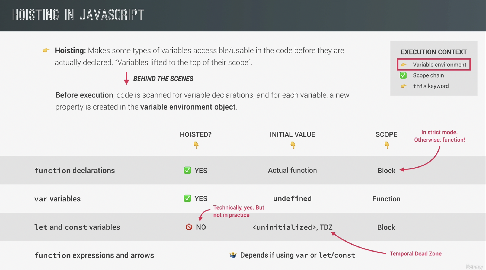

# JS 강의 노트

## 헷갈렸던 것 + 몰랐던 것 위주로 정리!

<br>
<br>

---

# 1. Fundamentals

<br>

### strict mode

- 자바스크립트는 에러가 발생해도 그냥 넘어가는 경우가 있다.
  <br>예를 들어, 선언된 적이 없는 변수에 값을 넣은 경우, strict mode가 아니라면 자동으로 선언해주어 값을 넣는다. 하지만 strict mode라면 not defined 에러가 발생한다.

<br>
ㅇ
### 함수 표현식?

- 익명함수를 만들고 이를 변수에 저장하는 것
  (함수 선언식은 기본적인 방식)

```html
const calcAge = function (birthYear) { return 2022 - birthYear; }
```

<br>

### 함수는 value 이다. (type이 아니다.)

- 그렇기 때문에 변수에 저장할 수 있다.

<br>

### 함수 선언식 vs 함수 표현식

<br>

- 함수 선언식은 선언 전에 사용이 가능하다! (hoisting)
  <br>하지만 함수 표현식은 사용이 불가능하며 두 가지 경우로 나뉜다.
  <br>
  <br>1. 변수를 let, const로 선언하였을 때
  <br>- Cannot access "함수이름" before initialization 에러 발생
  <br>발생이유? => let, const로 선언한 변수는 실질적으로 hoisting이 발생하지 않는다고 볼 수 있기 때문에 선언이 되기 전에 접근했다는 에러가 발생한다.
  <br>
  <br>2. 변수를 var로 선언하였을 때
  <br>"함수이름" is not a function 에러 발생
  <br>발생이유? => var로 변수를 선언하였기 때문에 hoisting에 의해 변수가 선언된 상태로 코드가 실행됨
  <br> 하지만 값이 없이 변수 선언만 된 상태이므로 not defined 에러 대신에 not a function 에러가 발생하는 것
  <br>(이 때 변수의 값은 undefined 이다. 변수 선언 후에 값을 지정하지 않은 상태이기 때문이다.)

<br>

---

<br>

# 2. JS Behind The Scenes

<br>

## 자바스크립트의 9가지 특징 🐻

<br>

### 1. High-level

- high-level 언어이기 때문에 컴퓨터의 resource를 직접 manage할 필요가 없다. (automatic)

<br>

### 2. Garbage-collected

- 오랫동안 사용되지 않은 object들을 자동적으로 컴퓨터의 메모리에서 삭제시킨다.

<br>

### 3. Interpreted or just-in-time compiled

- 나중에 설명

<br>

### 4. Multi-paradigm

- 다음 3가지 paradigm 모두 사용 가능하다.
- Procedural programming (절차지향 프로그래밍)
- Object-oriented programming (객체지향 프로그래밍)
- Functional programming (함수형 프로그래밍)

<br>

### 5. Prototype-based object-oriented

- JS에서 primitive type을 제외하면 모두 object이다. (array, function 등)

- 자세한건 나중에 설명

<br>

### 6. First-class functions

- 일급 함수라고 하며 함수가 변수처럼 다뤄지는 것을 뜻한다. 예를 들면, 함수의 파라미터로 또 다른 함수가 들어갈 수 있는 점이 있다.

<br>

### 7. Dynamic

- Dynamically-typed language이고 이는 변수를 선언할 때 타입을 지정하지 않고 런타임 때 타입이 정해지게 된다.

<br>

### 8. Single-threaded

- JS는 single-threaded 언어이기 때문에 한 번에 하나의 작업만을 수행할 수 있다. (only do one thing at a time)

<br>

### 9. Non-blocking event loop

- single-threaded는 만약 시간이 오래걸리는 작업을 먼저 수행한다면 뒤의 모든 작업들이 실행되지 못하는 blocking 현상이 발생할 수 있다. 하지만 JS는 event loop를 사용하여 blocking 현상이 일어나지 않도록 한다.

<br>
<br>
<br>

## Compilation 🆚 &nbsp;Interpretation

코드를 실행하기 위해서는 먼저 기계어로 변환되어야 한다. 그 방식에는 compilation과 interpretation 두 가지가 있다.

<br>


<br>

### Compilation

- 우선, 소스코드가 machine code로 번역된 file로 변환된다.

- 해당 file을 실행하면 프로그램이 실행된다.
- 장점: interpretation보다 빠르다.

<br>

### Interpretation

- 소스코드를 line-by-line으로 실행한다. (느림)

<br>

### Just-in-time compilation (JIT)

- 현재 자바스크립트가 사용하는 방식 (성능 개선을 위함)

- 먼저 전체 코드가 machine code로 변환된 후에 바로 실행된다.

<br>

### JS 엔진의 작동 방식

1. Parsing

- 전체 코드가 abstract syntax tree (AST)로 파싱된다. (트리 형태)

- 의미 있는 조각으로 나눈다 (const, function 등의 키워드로)
- 파싱된 결과는 machine code를 생성하기 위해 사용된다.

<br>

2. Compilation

- 파싱된 결과로 machine code로 변환시키는 과정

<br>

3. Execution

- compilation의 결과를 실행

<br>

4. optimization

- JS 엔진은 처음에 매우 unoptimized한 버전의 machine code를 만들게 된다. 왜냐하면 일단 최대한 빠르게 실행을 해야하기 때문에 최적화를 시키지 않기 때문이다.

- 그 뒤로 background에서 recompiling을 통해 optimization을 수행한다. (실행을 멈추지 않는다)

<br>

<br>

## JS RUNTIME

<br>

### 1. Event Loop

<br>

- runtime => JS를 사용하기 위해 필요한 모든 것들이 담긴 container라고 할 수 있다.

- JS 엔진, WEB APIs, Callback Queue로 이루어져 있다. (크게 볼 때 3개)

- WEB APIs는 브라우저에서 제공되며 window object (전역 객체)로 접근할 수 있다. 그리고 브라우저에서 제공되는 것들이기 때문에 node.js의 runtime에는 이 부분이 빠지게 된다.

- 실행할 준비가 완료된 모든 콜백함수들이 들어있는 queue이다.

<br>

<br>

## 실행 컨텍스트 (Executiion context)

<br>

JIT 방식의 parsing - compilation - execution 의 3가지 단계 중 마지막 execution 단계에 대한 부분이다.

<br>

### 실행 방식

<br>

1. compilation의 결과로 machine code가 생성되어 execution이 시작된다. 이 때 global execution context (for top-level code)가 생성된다. 여기서 top-level code란 어떤 함수 안에 있지 않은 코드를 말한다. (함수 호출 없이도 실행되어야 하는 코드들)

<br>

2. global Execution context가 생성된다. 이것은 단 하나만 존재한다.

<br>

3. 함수를 실행하고 callback을 기다린다.

<br>

function은 모두 자기 자신만의 execution context를 갖는다. 함수가 호출될 때 생성된다. (호출될 때 call stack에 들어감)

<br>

### Execution context 구성

<br>

실행 직전에 만들어진다.

<br>

1. variable environment

- let, const, var 선언
- functions
- arguments object (not in arrow function)

<br>

2. scope chain

<br>

3. this (not in arrow function)

<br>

## Call Stack

<br>

Call stack은 JS엔진에 있으며 코드가 실행될 때 현재 어떤 execution context를 실행중이고 이게 끝나면 어떤 execution context로 돌아가야 하는지 알 수 있게 해준다.


<br>

예를들어 위의 사진의 코드를 실행한다고 하면 가장 먼저 global execution context가 call stack에 들어가서 실행된다.

<br>

global execution context는 어떤 함수 안에도 속해있지 않은 코드들만 실행되는 것이기 때문에 두개의 함수 선언식, 표현식은 실행되지 않고 가장 마지막의 first 함수 호출이 실행된다.

<br>

이 때, first 함수가 실행되어야 하기 때문에 first 함수만의 execution context가 생성되어 call stack에 들어가게 된다.

<br>

그리고 first 함수를 실행하던 중에 second 함수를 실행하도록 코드가 작성되어있기 때문에 second 함수의 execution context가 생성되어 call stack에 들어간다.

<br>

그 뒤로 second 함수의 return이 실행되고 second 함수의 execution context는 call stack에서 pop된다.

<br>

그 다음은 call stack의 가장 위에 first 함수가 남게 되기 때문에 first 함수의 남은 부분을 실행한다. 여기서 이게 가능한 이유는 call stack 때문이다. second 함수 실행이 종료된 후에 어디로 갈 지 알 수 있었기 때문이다. 마찬가지로 first 함수 또한 return 되어 종료되고 나면 call stack에서 pop되고 그 뒤에 call stack의 가장 위에 남은 global execution context가 남은 부분을 실행하고 call stack에서 pop되어 실행이 종료된다.

## Scope & Scope Chain

<br>

### 용어 설명

<br>

1. scoping

- scope를 생성하는 과정, 방법 정도로 이해

- 변수들이 어디에 있고, 어디서 접근 가능하고 또는 접근이 불가능한지

<br>

2. lexical scoping

- scoping은 함수 또는 코드블럭이 어디에 위치해있는가 (어디에서 작성되었는가)에 따라 결정된다.

<br>

3. scope

- 함수 또는 변수가 선언된 공간/환경

- scope에는 global scope, function scope, block scope가 있다.

<br>

4. scope of variable

- 어떤 변수에 접근(access)할 수 있는 곳

<br>

### scope의 종류

<br>

1. global scope

- 모든 함수와 코드블럭의 외부에 존재하는 변수들의 scope

- global scope의 변수들은 코드의 어떤 곳에서도 접근이 가능하다.

<br>

2. function scope

- 함수 내부에서 선언된 변수, 함수들의 scope

- 함수 내부에서만 접근이 가능하다
- 다른 말로는 local scope라고 한다.

<br>

3. block scope (ES6+)

- 코드블럭 내부에서 선언된 변수, 함수들의 scope (function, if, for)

- let과 const로 선언된 변수들만 적용되며 var은 이것에 적용되지 않는다 (ES6 이전에 나온 것이기 때문에)

- 함수는 strict mode에서 block scope이다. (strict mode 아니면 function scope)

<br>

### Scope Chain

<br>

모든 스코프는 자신의 바깥에 있는 변수들에 접근이 가능하다. 이것이 스코프 체인이다.

<br>

어떤 변수에 access하려고 할 때, 자기 자신의 scope(current scope)에 찾고있는 변수가 있다면 그것을 사용한다. 하지만 없다면 scope chaining을 통해 변수를 찾게된다.

<br>

우선 자기 자신의 scope에 해당 변수가 없다면 먼저 자신의 바로 위의 스코프로 가서 변수를 찾는다. 여기서 바로 위라는 말은 자기 자신의 가장 가까운 부모의 scope이다.

<br>


위의 사진에서 second 함수에서 myName 변수와 age 변수에 접근해야 한다.

하지만 second 함수 내부에는 해당 변수들이 존재하지 않는다. 그래서 scope chain을 해서 바로 위의 scope인 first 함수의 scope에서 변수들을 찾는다.

여기서 age 변수는 찾았지만 myName 변수는 찾지 못했다. 그래서 그보다 바로 하나 더 위의 scope인 global scope로 이동해서 찾는다.

여기서 decade 변수는 const로 선언되었기 때문에 if 블럭 안에서만 접근 가능하다.

<br>

주의) scope chain은 코드가 쓰여진 위치에 따라 결정되는 것이고 함수가 호출된 위치는 상관없다.

<br>

### 정리

<br>


<br>

<br>

## Hoisting

<br>

변수들이 선언되기 전에 접근 또는 사용이 가능한 경우가 있다. 이것은 hoisting이 일어났기 때문이다.

변수들이 코드의 최상단으로 끌어올려졌다고도 표현한다.

<br>

### 발생하는 이유?

- 코드 실행 전(creation phase)에 먼저 코드를 스캔한다. 이 때 변수 선언이 있다면 execution context의 variable environment의 object의 프로퍼티로 저장되기 때문에 접근, 사용이 가능해지는 것이다.

<br>

### 변수/함수 종류 별 hoisting 여부 정리

<br>



<br>

1. function declaration

- 호이스팅 발생

- 선언 전에 접근+사용 가능
- strict mode에서는 block scope, 아니라면 function scope

<br>

2. var variables

- 호이스팅 발생

- 선언 전에 접근 가능, 값은 undefined
- function scope

<br>

3. let, const variables

- 호이스팅 발생은 하지만 기능적으론 발생하지 않은 것과 같음

- 선언 전에 접근 불가능, 하지만 접근하려 하면 referrence error가 나오지 않고 cannot access before initialization 에러가 발생 (TDZ)
- block scope

<br>

4. function expressions and arrows

- 함수가 담길 변수를 var, let, const 중 어떤 것으로 선언했는지에 따라 hoisting 여부가 결정됨

- 선언 전 접근 여부도 위와 같이 결정됨, var이라면 접근가능, 하지만 함수 사용은 불가능 (undefined) / let, const라면 접근 불가능 (uninitialized)
- scope 또한 var, let, const에 따라 다름

<br>

<br>

## TDZ

<br>

Temporal Dead Zone

변수 선언 전에 해당 변수에 접근하는 것

not defined가 아닌 cannot access before initialization 에러 발생
(creation phase때 코드를 스캔하여 선언될 변수들을 미리 variable environment에 넣었기 떄문에 언젠간 선언될 것이라는 것을 알고있다.)


사진의 붉은 부분이 TDZ이다. 쉽게 말하면 변수가 선언되기 전 까지의 코드 부분이 TDZ라고 할 수 있다. 이 TDZ에서는 변수에 접근할 수 없다.

<br>

<br>

## This

- 모든 execution context (즉, 함수) 마다 생성되는 특별한 변수

- static하지 않은 변수이다. this는 함수가 어떻게 호출되었는지에 따라 어떤 값을 가질 지 결정된다. 그리고 그 값은 <b style="color: skyblue">함수가 실제로 호출되었을 때에만 값이 지정된다.</b>

<br>

### this 값이 지정되는 경우 (함수 호출 방식)

<br>

1. method 호출

- <b style="color: skyblue">자기 자신을 호출한 object가 this값이 된다.</b>

- 만약 method가 arrow function 이라면 자신을 호출한 object가 아닌 lexical this

- method 내부의 this가 자신의 바깥의 object를 가리키는 이유는 그 object의 내부에서 작성되었기 때문이 아니라 그 object가 호출(사용)했기 때문이다. 예를 들어 a,b object가 있고 a의 내부에 calcAge라는 method가 있고 이 method에서 this를 사용했을 때, b.calcAge = a.calcAge로 b에서 a의 method를 borrow했을 때 b.calcAge를 실행시켜보면 this는 b object를 가리키고 있는 것을 확인할 수 있다.
  method가 작성된 곳은 a object이지만 b에서 빌려서 호출하니 this는 b를 가리키고 있는 것이다. 따라서 method의 this는 자신을 <b style="color: skyblue">호출한 obejct</b>를 가리킨다.
- 만약 위와같은 방법으로 일반적인 변수에 method를 copy시켜서 함수를 호출시켰다면? => 일반적인 함수호출이기 때문에 2번과 같은 결과가 나온다.

<br>

2. 일반적인 호출 (simple function call)

- this = undefined (only in strict mode)

- this = window obejct (global object) (not in strict mode)
- method의 내부함수에서의 this는 2번과 같다. method의 경우에는 1번과 같이 동작하지만 method의 내부함수는 다르다.
- 내부함수의 this문제 해결법에는 두가지가 있다.
- 첫 번째로 method 내부에 const self = this로 변수를 만들어 주고 이를 내부함수에서 사용한다. (es6 이전의 방식)
- 두 번째는 내부함수를 arrow function으로 선언하는 것이다. arrow function은 this값이 자신의 상위 스코프를 가리키게 되기 때문에 method와 같은 this를 갖게되고 이는 object의 scope와 같다. (es6+ 방식)

<br>

3. arrow function 호출

- this = 자신의 바로 위의 scope (surrounding function, lexical this)

- method로는 arrow function을 사용하지 않는 것이 좋다. this 키워드가 자신의 바로 위의 scope로 지정되기 때문에 혼동(원하지 않는 결과)이 오기 쉽다. object literal의 코드블럭은 자신만의 scope를 갖게되는 것이 아니므로 object의 method로 arrow function을 사용했다면 this로 object의 내부의 값을 참조할 수 없다.

<br>

4. event listener로 호출

- this = DOM element that the handler function attatched to

<br>

5. new 연산자로 호출

- later section

<br>

<br>

## Arguments

- 파라미터로 넘긴 값들이 들어있는 객체

- 함수 선언식, 함수 표현식에만 사용 가능하며 arrow function에서는 사용할 수 없다.

<br>

<br>

## Primitives vs Objects

<br>


위의 코드에서 oldAge의 값은 age의 값이 변경되기 전의 값이 그대로 유지되었지만 me object의 age는 friend.age에 의해 함께 변한 것을 볼 수 있다. 그 이유는 무엇일까

<br>

### Primitive와 Object의 차이

- primitive는 call stack에 저장되며 object는 memory heap에 저장된다. (이 둘은 JS Engine에 있음) <br>
  primitive가 call stack에 저장된다는 말은 자신들이 선언된 execution context의 내부에 저장된다는 뜻이다. (call stack에 들어가는 execution context의 내부에 들어간다는 뜻)

<br>


(위의 사진 설명)

<br>

primitive value는 call stack의 자신이 선언된 execution context에 저장되며 address와 value를 갖는다. <br>
먼저 age라는 변수를 선언하고 값을 30으로 넣어주었기 때문에 0001주소에 30이라는 값이 들어가게 되고 age 변수는 이를 가리키게 된다. <br>
그리고 oldAge는 oldAge = age에 의해 age가 가리키고 있는 0001주소를 가리키게 되고 그렇기 때문에 똑같이 30이라는 값을 갖게된다.<br>
하지만 age = 31에 의하여 age변수의 값은 31로 변경되었다.
<br>
여기서 주목할 점은, call stack의 memory adress의 값은 immutable(불변)하다는 것이다.
<br>
그렇기 때문에 0001 주소의 value가 31로 변경되는 것이 아니라 0002라는 새로운 주소에 31이라는 값을 넣고 age변수가 이를 가리키게 되는 것이다. <br>
그렇기 때문에 age는 31, oldAge는 30의 값을 갖게되는 것이다.

<br>
<br>
하지만 reference value (object)는 사진과 같이 값을 저장한다.<br>
call stack의 메모리 공간의 0003이라는 주소에 D30F라는 value를 갖게된다.<br>
object의 value는 call stack에 담기기에 너무 클 수 있기 때문에 비교적 unlimited한 heap에 저장하는 것이다. <br>
여기서 주목할 점은 value가 일반적인 value가 아닌 memory heap의 주소라는 것이다. 이 value는 memory heap의 주소를 갖고 있기 때문에 이를 이용해서 heap에 저장되어있는 value를 갖고온다.
<br>
me와 friend는 동일한 주소를 가지고 있고, 그렇기 때문에 friend.age를 변경하였을 때 heap의 value가 변경되어 me.age까지 27로 변경된 것이다.
<br>
여기서 friend object는 const로 선언되었음에도 불구하고 변경이 가능했는데 그 이유는 call stack의 value는 변경되지 않았기 때문이다.
<br>
me와 friend object는 서로다른 identifier가 완전히 동일한 reference를 가리키고 있는 것이다.

따라서 object를 copy하는 것은 진짜 copy하는 것이 아닌 그저 같은 reference를 가리키고 있는 또 다른 변수를 생성한 것 뿐이다.

<br>
<br>

---

# 3. A Closure Look at Functions

<br>

## Default Prameters


<br>

- 주석 처리된 부분은 pre ES6 방식이고 파라미터로 넘겨주는 것이 ES6+ 방식이다. (price = 199 이 부분)

- 파라미터 안넘겨주면, 또는 undefined로 넘겨주면 default parameter로 들어간다.
- price = 199 * numPassengers 이런식으로 넣어주면 자동으로 인원수*1인가격 계산해줌

<br>

## Passing Arguments

<br>


<br>

parameter로 넘겨줄 때, arguments는 parameter의 copy라고 보면 된다.

<b>passing by value vs reference</b>

- flight (primitive) 변수와 jonas object를 함께 파라미터로 넘겨준 뒤에 함수 내부에서 두 arguments를 변화시킴, 하지만 flight 변수는 변경되지 않았고 jonas object는 변경됨

- flightNum argument는 flight 변수를 copy한 primitive 변수이기 때문에 앞서 배운 내용에 따라 원본은 변경되지 않는 것을 알 수 있음

- 하지만 jonas object는 reference variable이기 때문에 주소 자체를 넘겨준 것임, 따라서 passenger argument를 변경시키면 jonas object가 가리키고 있는 주소의 value를 변경시킨 것이기 때문에 jonas object도 변경되어 나오는 것

<br>

## First-Class Functions

<br>

- programming language의 feature라고 할 수 있다. (모든 함수는 value이다)

- JS는 function을 first-class citizen으로 다룬다. 이것은 function이 단순한 value라는 것을 의미한다. 그 이유는 function은 object의 또 다른 type이기 때문이다. (object는 value이니까)

- 이것은 function으로 부터 function을 return할 수 있음을 의미한다. (function = value 이니까) 이는 매우 유용하게 사용 가능하다.

- Function은 object이기 때문에 method를 가지고 있다.

- First-class function은 higher-order function을 사용/작성 가능하게 해준다.

<br>

## Higher-Order Functions

<br>

- First-class function이 있기 때문에 가능한 것 (first-class function의 가장 위의 설명과 이것이 둘의 차이점)

- Higher-order function은 함수를 arguments로 받거나 함수를 return하는 함수이다. (또는 둘 다 하는 함수)

- 예를 들어, addEventListener 함수는 2번 째 파라미터로 콜백 함수를 받는다. (변수로써)

<br>

### Functions Accepting Callback Functions

<br>

 

transformer 함수에서 callback함수를 fn으로 받고 사용한 모습이다. 여기서 파라미터를 넘겨줄 때 upperFirstWord, onWord 이런 식으로 변수의 형태로 넘겨준 것이 포인트이다.

함수를 파라미터로 넘겨주는 것은 abstract한 장점이 있다. transformer 함수는 string을 변환시켜주는 역할을 한다. 하지만 실제로 어떻게 변환하는 지는 전혀 신경쓰지 않는다 (알지 못한다). 그저 넘겨준 콜백함수를 실행시키는 것 뿐이다.

higher-order function = operates higher level of abstraction, leaving the low level details to low level functions (call back) (low level function이라는 말은 없고 그냥 설명을 위한 단어 사용)

<br>

### Functions Returning Functions

<br>


<br>

greeterHey는 함수가된다. (return된 함수를 받은 것)

그리고 greeting은 Hey로 고정된 상태이다.

greet("Hello")("Steven") 이런 식으로도 사용 가능하다. 왜냐하면 greet("Hello") 자체가 함수이기 때문이다.

greet 함수를 arrow function으로 다시 작성해보면 위의 greetArr와 같이 된다. arrow를 두개 사용한다.
